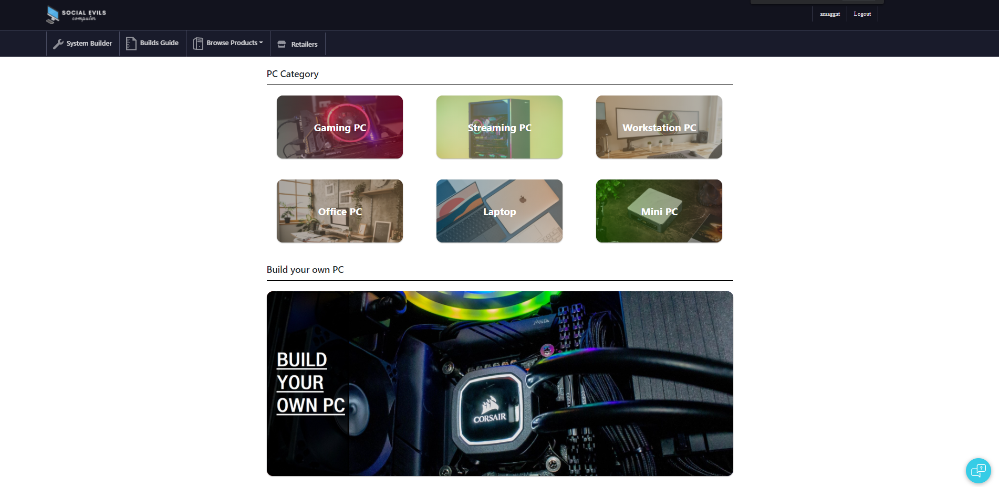
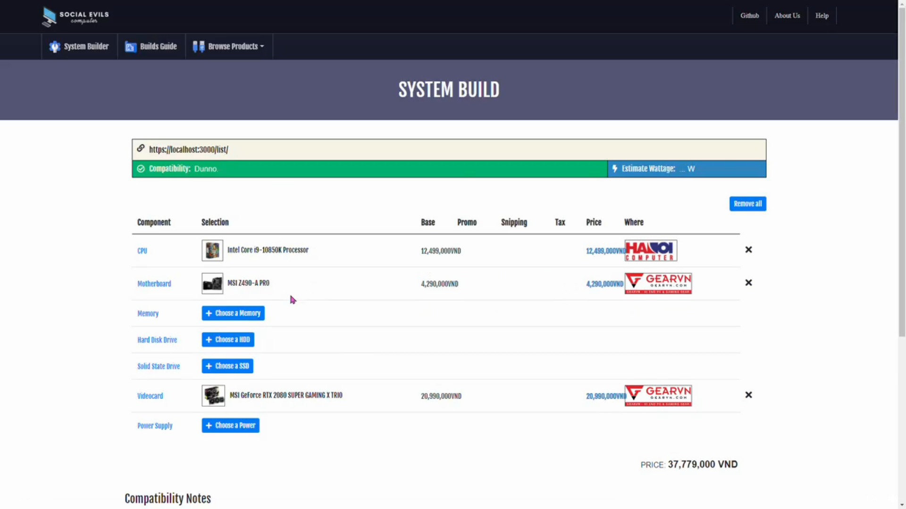
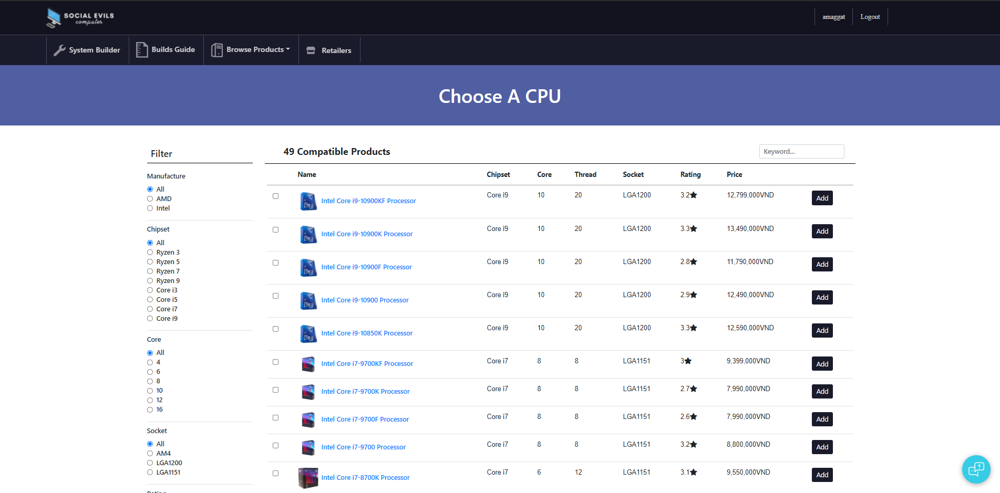
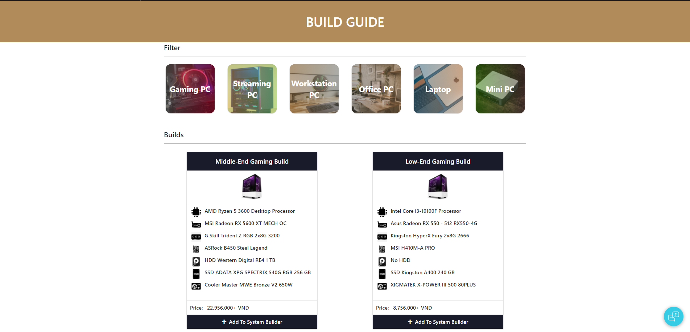
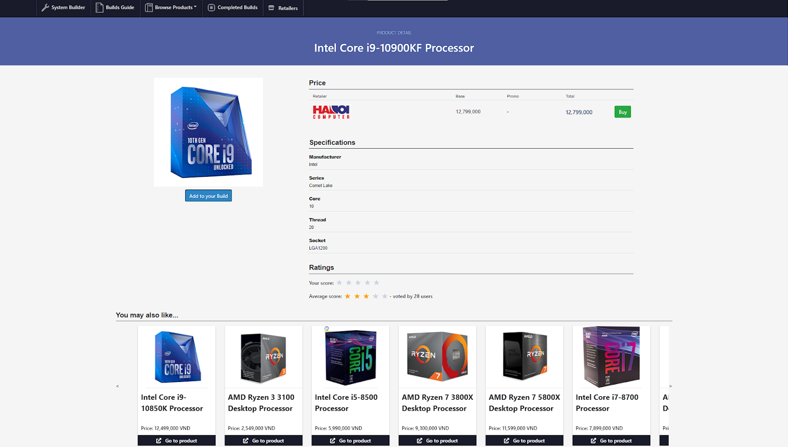
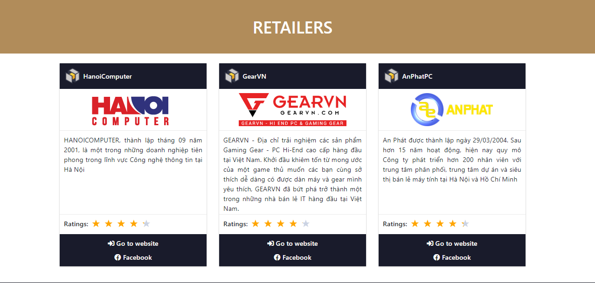

# [PCRS-VN](name)

## [Introduction](#introduction)

PCRS-VN is our project on Web application development course
at [VNU University of Engineering and Technology](http://uet.vnu.edu.vn/). We were inspired
by [PcPartPicker](http://pcpartpicker.com), a website that allows users create their own PC and check their
compatibility, it also allow users to compare price from different retail stores.

## [Demo](demo)

1. The homescreen:
   
2. The System Builder:
   
3. Browsing PC components:
   
4. We have compiled a list of multi-purpose PCs, with filters for users to narrow down their choice:
   
5. Product details with ratings and similar products:
   
6. All products were crawled from different retail stores. We want to create a website where user can easly check for their items for their wishlist with its price, promo from retailer ...
   

## [Usage](usage)
We are still working on deployment.
The website will avaiable someday soon, thanks for your patient.

## [Database](data)

We crawl product, price, promo, ... from many retail stores such as [GearVN](https://gearvn.com/)
, [AnPhat](https://www.anphatpc.com.vn/), [HanoiComputer](https://www.hanoicomputer.vn/), ... that users can access
easly.

*Note:* All the data we have are crawled from their public website.

## Front-end

In the project directory, you can run:

### `npm install`
To install all the dependencies


### `npm start`

Runs the app in the development mode.\
Open [http://localhost:3000](http://localhost:3000) to view it in the browser.
The page will reload if you make edits.
You will also see any lint errors in the console.

*For more detail, please checkout our Front-end service [here](https://github.com/amaggat/PCRS-VN-Frontend)*


## Back-end

1. Add application.properties to src/main/resources with below content

```
spring.jpa.hibernate.ddl-auto=none
spring.datasource.url= jdbc:mysql://localhost:3306/ (link to pcrs database)
spring.datasource.username= (insert username)
spring.datasource.password= (insert password)
spring.servlet.multipart.enabled=true
# Threshold after which files are written to disk.
spring.servlet.multipart.file-size-threshold=2KB
# Max file size.
spring.servlet.multipart.max-file-size=200MB
# Max Request Size
spring.servlet.multipart.max-request-size=215MB
## File Storage Properties
# Please change this to the path where you want the uploaded files to be stored.
file.upload-dir=(Directory)/PCRS-Chatbot/voice/audio
```


2. Import database.sql to MySQL with your database.

3. Run ```BackEndApplication.java``` and you ready to go.


*For more detail, please checkout our Back-end service [here](https://github.com/amaggat/PCRS-VN-Backend)*


## Recommender
1. If you are familiar with Docker and Docker Compose, here is the "one-liner":

```git clone https://github.com/actionml/harness-docker-compose.git && cd harness-docker-compose && cp .env.sample .env && docker-compose up -d --build```

2. Move config.json to harness-docker-compose/docker-persistence/harness/data.
3. Open harness-cli. Use this command:```harness-cli add data/config.json```
4. Run ```Setup.java``` and you ready to go.

*For more detail, please checkout our Recommender service [here](https://github.com/amaggat/PCRS-VN-Recommender)* \
*For more commands, please checkout [here](https://actionml.com/docs/h_ur_queries)*

## Chatbot
1. Install all requirements
2. Run ```application.py``` and you ready to go.

*For more detail, please checkout our Chatbot service [here](https://github.com/amaggat/PCRS-VN-Chatbot)*

## [Our team](team)
- Dung M. Nguyen
  [Contact: [GitHub](https://github.com/manhdung20112000) [Facebook](https://www.facebook.com/nmd2000)]

- Thanh T. Tran
  [Contact: [GitHub](https://github.com/amaggat) [Facebook](https://www.facebook.com/messages/t/100005149897099)]

- Nhat Q. Le
  [Contact: [GitHub](https://github.com/fuzeless) [Facebook](https://www.facebook.com/fuzeless)]

- Hung P. Quang
  [Contact: [GitHub](https://github.com/heor2807) [Facebook](https://www.facebook.com/srw.king)]

- Binh M. Le
  [Contact: [GitHub](https://github.com/LukeShrek) [Facebook](https://www.facebook.com/luke.shrek)]
  
- Hieu M. Tran
  [Contact: [GitHub](https://github.com/hieutm211) [Facebook](https://www.facebook.com/hieutm211x)]

- Hieu V. Pham
  [Contact: [GitHub](https://github.com/hieuphamjr) [Facebook](https://www.facebook.com/HieuPhamJR11)]

##### *Special thanks to:*
- Anh T. Tran
  [Contact: [GitHub](https://github.com/zzNuAzz) [Facebook](https://www.facebook.com/SoNguyenTo216/)]


