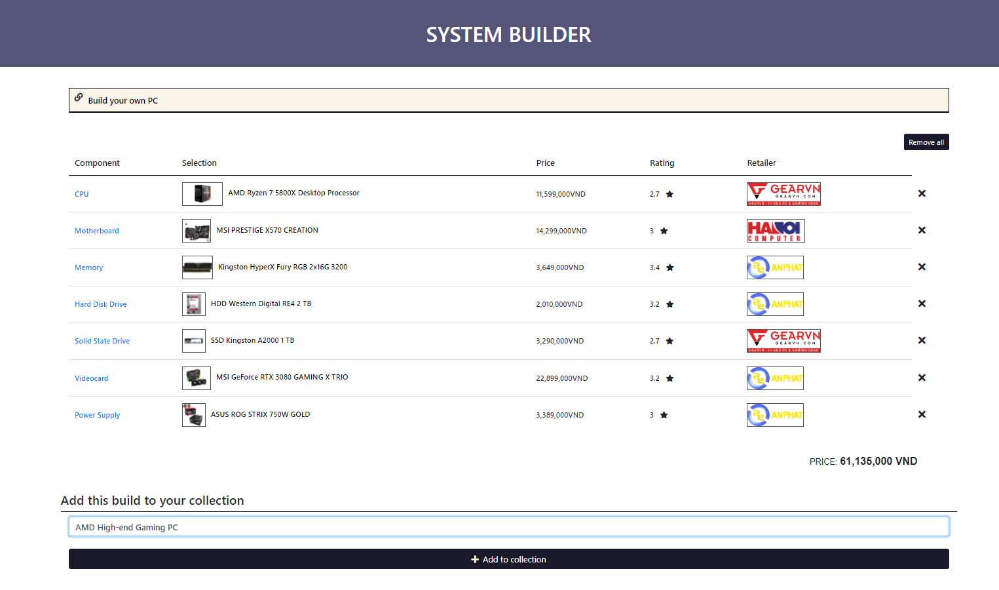

# [PCRS-VN](name)

## [Introduction](#introduction)
PCRS-VN is our project on Web application development course at [VNU University of Engineering and Technology](http://uet.vnu.edu.vn/).
We were inspired by [PcPartPicker](http://pcpartpicker.com), a website that allows users create their own PC and check their compatibility, it also allow users to compare price from different retail stores.

## [Demo](demo)

1. The homescreen:

2. The System Builder:

3. Browsing PC components:

4. We have compiled a list of multi-purpose PCs, with filters for users to narrow down their choice:

5. Product details with ratings and similar products:

6. All products were crawled from different retail stores. We want to create a website where user can easly check for their items for their wishlist with its price, promo from retailer ...

## [Database](data)
We crawl product, price, promo, ... from many retail stores such as [PhongVu](https://phongvu.vn/), [AnPhat](https://www.anphatpc.com.vn/), [HanoiComputer](https://www.hanoicomputer.vn/), ... that users can access easly.

*Note:* All the data we have are crawled from their public website.

**The database architecture:**

*For more detail, please checkout our backend service [here](https://github.com/amaggat/PcPartPickerVN_BackEndService)*

## [Usage](usage)
We are still working on deployment. 
The website will avaiable someday soon, thanks for your patient.
## [Our team](team)
- Dung M. Nguyen 
[Contact: [GitHub](https://github.com/manhdung20112000) [Facebook](https://www.facebook.com/nmd2000)]

- Thanh T. Tran
[Contact: [GitHub](https://github.com/amaggat) [Facebook](https://www.facebook.com/messages/t/100005149897099)]

- Nhat Q. Le
[Contact: [GitHub](https://github.com/fuzeless) [Facebook](https://www.facebook.com/fuzeless)]

- Hung P. Quang
[Contact: [GitHub](https://github.com/heor2807) [Facebook](https://www.facebook.com/srw.king)]

- Binh M. Le
[Contact: [Facebook](https://www.facebook.com/luke.shrek)]

- Hieu V. Pham
[Contact: [GitHub](https://github.com/hieuphamjr) [Facebook](https://www.facebook.com/HieuPhamJR11)]

##### *Special thanks to:*
- Anh T. Tran
[Contact: [GitHub](https://github.com/zzNuAzz) [Facebook](https://www.facebook.com/SoNguyenTo216/)]

